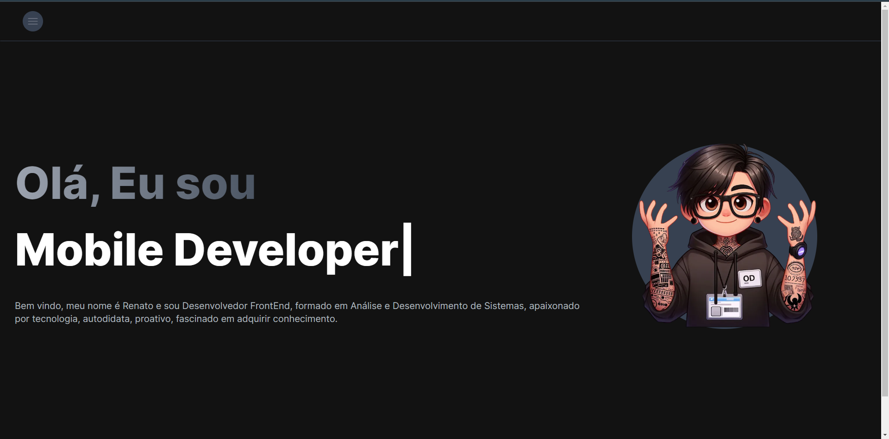

[JAVASCRIPT__BADGE]: https://img.shields.io/badge/Javascript-000?style=for-the-badge&logo=javascript
[TYPESCRIPT__BADGE]: https://img.shields.io/badge/typescript-D4FAFF?style=for-the-badge&logo=typescript
[REACT__BADGE]: https://img.shields.io/badge/React-005CFE?style=for-the-badge&logo=react
[NEXT_BADGE]: https://img.shields.io/badge/next.js-000000?style=for-the-badge&logo=nextdotjs&logoColor=white
[PROJECT__BADGE]: https://img.shields.io/badge/📱Visit_this_project-000?style=for-the-badge&logo=project
[PROJECT__URL]: https://next-portfolio-renatofujimoto.vercel.app/

<h1 align="center" style="font-weight: bold;">My Portfolio 💻</h1>

![react][REACT__BADGE]
![next][NEXT_BADGE]
![typescript][TYPESCRIPT__BADGE]
![javascript][JAVASCRIPT__BADGE]

<p align="center">
 <a href="#about">About</a> • 
 <a href="#started">Getting Started</a> • 
</p>

<p align="center">
    
</p>

<h2 id="started">📌 About</h2>

Simple description of what your project do or how to use it.

[![project][PROJECT__BADGE]][PROJECT__URL]

<h2 id="started">🚀 Getting started</h2>

Here you describe how to run your project locally

<h3>Prerequisites</h3>

Here you list all prerequisites necessary for running your project. For example:

- [NodeJS](https://github.com/)
- [Git 2](https://github.com)

<h3>Cloning</h3>

How to clone project

```bash
git clone https://github.com/Renatofujimoto/next-portfolio.git
```

<h3>Starting</h3>

How to start your project

```bash
cd next-portfolio
npm install
or
yarn install
------------
npm run dev
or
yarn dev
```

<h2 id="contribute">📫 Contribute</h2>

Here you will explain how other developers can contribute to your project. For example, explaining how can create their branches, which patterns to follow and how to open an pull request

1. `git clone https://github.com/Renatofujimoto/next-portfolio.git`
2. `git checkout -b feature/NAME`
3. Follow commit patterns
4. Open a Pull Request explaining the problem solved or feature made, if exists, append screenshot of visual modifications and wait for the review!

<h3>Documentations that might help</h3>

[📝 How to create a Pull Request](https://www.atlassian.com/br/git/tutorials/making-a-pull-request)

[💾 Commit pattern](https://gist.github.com/joshbuchea/6f47e86d2510bce28f8e7f42ae84c716)
